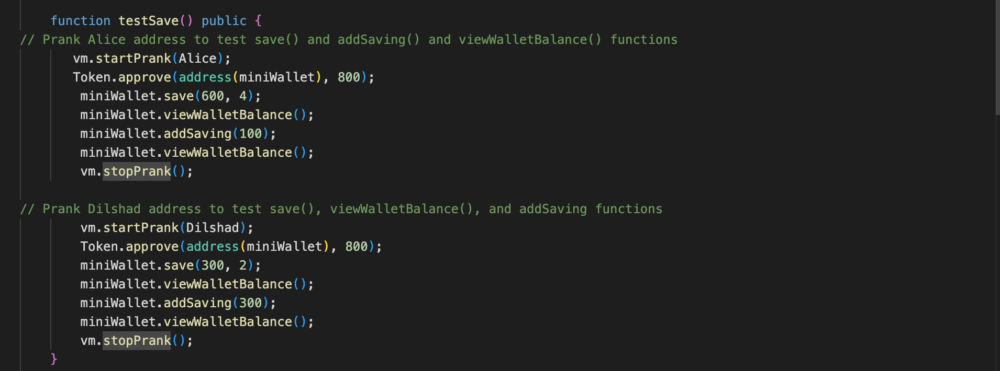

# Foundry: Deploying and Forking the Celo Mainnet With Foundry 

## Table Of Contents 
- [Foundry: Deploying and Forking the Celo Mainnet With Foundry](#foundry-deploying-and-forking-the-celo-mainnet-with-foundry)
	- [Table Of Contents](#table-of-contents)
	- [Introduction](#introduction)
	- [Objective](#objective)
	- [Prerequisites](#prerequisites)
	- [Requirements](#requirements)
	- [Getting Started](#getting-started)
	- [Smart Contract](#smart-contract)
		- [Savings Smart Contract](#savings-smart-contract)
			- [Savings.sol](#savingssol)
		- [Token Smart Contract](#token-smart-contract)
			- [Token.sol](#tokensol)
	- [Smart Contract Testing](#smart-contract-testing)
		- [Test Code -\> MiniWallet.sol](#test-code---miniwalletsol)
		- [Fork the Celo Alfajores Testnet](#fork-the-celo-alfajores-testnet)
		- [Test Code Explained](#test-code-explained)
	- [Deploy Smart Contract](#deploy-smart-contract)
	- [Conclusion](#conclusion)
	- [References](#references)
* [Conclusion](#conclusion)
* [References](#references)


## Introduction
Some of us smart contract developers danced the bhangra when Foundry was released.
**Foundry is a convenient and comprehensive suite of tools for building and deploying decentralized applications (dApps) on the blockchain**. It is convenient because it lets you write tests in Solidity instead of Javascript, which is the scripting and testing language of the popular Hardhat toolkit.

In this tutorial, I will take you through how to deploy smart contracts and fork the Celo Alfajores testnet with **Foundry**. Forking mainnet or testnet is the process of copying the network's current or previous state and bringing it into your local development network. While the remaining transactions or blocks are mined and added to your personal development network, you will be able to access the deployed smart contracts in the mainnet for testing purposes. By forking a blockchain, we can test and debug smart contracts in a local environment, which simulates the behavior of the live blockchain network.  
I created this tutorial because there are surprisingly few resources available online that cover mainnet and testnet forking with Foundry.  

## Objective
At the end of this tutorial, you will be able to fork the Celo mainnet or testnet for testing and deploy a smart contract using the Foundry toolkit. 


## Prerequisites
This tutorial is focused on those who have some level of experience writing smart contracts with Foundry. However, if you are new to Foundry, I have listed some resources in the [reference](#references) section that can help you get familiar with this toolkit.  
Before going ahead with the tutorial, it is important for you to have a good understanding of:

* [solidity](https://soliditylang.org),
* [smart contracts](https://www.ibm.com/topics/smart-contracts), 
* [The EVM](https://ethereum.org/en/developers/docs/evm/), and
* [Foundry](#references). 

## Requirements
* [Infura account](https://app.infura.io/dashboard):  
Infura is a node provider that allows developers to plug into blockchains such as Ethereum, Avalanche, and Celo via Infura self-managed nodes. This saves developers the time, money, and work, which would they would have to put in to run their own node.  
* [Foundry](https://book.getfoundry.sh/getting-started/installation):  
It is important to have Foundry installed on your computer.
* [IDE](https://www.veracode.com/security/integrated-development-environment):  
Have an Integrated Development Environment of your choice installed. We will be using `Visual Studio Code [VSCode]` for this tutorial.


## Getting Started
Let us go through steps to seeting up our project.

- **Create a project folder**.
  
	In your terminal, run the following command to create a new folder:  

	```bash
	mkdir MiniWallet
	```

- **Navigate into your new project folder:**  

	```bash
	cd MiniWallet
	```  

- **Clone this repository:**
Clone this repository into your new folder:  

	```bash
	git clone https://github.com/centie22/Foudry-Tutorial.git
	```

- **Navigate into the smart contract folder:**

	```bash
	cd Foudry-Tutorial
	```

- **Install all dependencies:**

	```bash
	forge install
	```

- **Open project in IDE:**

	```bash
	code .
	```  

Now that we have our project all set up, let us go through the smart contracts and their functions.  

## Smart Contract
We are working with the two smart contracts in the `src` folder, `savings.sol` and `token.sol`. Let's briefly examine these smart contracts.

### Savings Smart Contract  

#### Savings.sol
```solidity
// SPDX-License-Identifier: MIT
pragma solidity ^0.8.7;

import "@openzeppelin/contracts/token/ERC20/ERC20.sol";
import "@openzeppelin/contracts/token/ERC20/utils/SafeERC20.sol";

contract MiniWallet {
    address admin;
    bool public savingActive;
    ERC20 savingToken;

    struct Wallet {
        address walletOwner;
        uint walletBalance;
        uint savingDuration;
    }

    mapping(address => Wallet) savingWallet;

    modifier adminRestricted() {
        require(
            msg.sender == admin,
            "Function call is restricted to contract admin"
        );
        _;
    }

    event Saved(uint amount, uint savingDuration, string message);
    event SavingUpdated(uint amount, string message);

    modifier isSavingActive() {
        require(savingActive == true, "Saving inactive");
        _;
    }

    modifier checkAmountAndBalance(uint256 _amount) {
        require(_amount > 0, "Can't save zero tokens");
        require(
            savingToken.balanceOf(msg.sender) >= _amount,
            "Current token balance less than _amount"
        );
        _;
    }

    constructor(ERC20 _savingToken) {
        admin = msg.sender;
        savingToken = _savingToken;
    }

    /**
        * @dev Only first time users can call this function. To increase savings, the addSaving() function should be called
        * @notice Allow users to create a wallet and save their savingTokens on the platform
        * @param _amount The amount of savingTokens to save to wallet
        * @param _savingDurationInWeeks The number of weeks to save the tokens on the platform
     */
    function save(
        uint256 _amount,
        uint256 _savingDurationInWeeks
    ) external isSavingActive checkAmountAndBalance(_amount) {
        require(
            _savingDurationInWeeks > 1,
            "Saving duration must be more than 1 week"
        );
        Wallet storage wallet = savingWallet[msg.sender];
        require(
            wallet.walletBalance == 0,
            "You already have a balance saved on the dapp."
        );

        savingToken.transferFrom(msg.sender, address(this), _amount);

        wallet.savingDuration =
            block.timestamp +
            (_savingDurationInWeeks * 1 weeks);
        wallet.walletOwner = msg.sender;
        wallet.walletBalance += _amount;

        emit Saved(_amount, _savingDurationInWeeks, "Tokens saved successfully");
    }

    /**
        * @dev Only existing wallets can use this function
        * @notice Allow users that own existing wallets to increase their savings
        * @param _amount The amount of savingTokens to deposit to wallet
     */
    function addSaving(
        uint256 _amount
    ) external isSavingActive checkAmountAndBalance(_amount) {
        Wallet storage wallet = savingWallet[msg.sender];
        require(wallet.walletBalance > 0, "You have not saved before.");

        SafeERC20.safeTransferFrom(
            savingToken,
            msg.sender,
            address(this),
            _amount
        );

        wallet.walletBalance += _amount;

        emit SavingUpdated(
            wallet.walletBalance,
            "Successfully saved more tokens."
        );
    }

    /**
        * @dev Users can only withdraw after savingDuration has been reached or exceeded
        * @notice Allow users to withdraw their funds stored in their wallets
        * @param _amount The amount of savingTokens to withdraw
     */
    function withdraw(uint256 _amount) external {
        Wallet storage wallet = savingWallet[msg.sender];
        require(msg.sender == wallet.walletOwner, "Caller not wallet owner.");
        require(
            wallet.walletBalance >= _amount,
            "_amount greater than balance."
        );

        if (block.timestamp >= wallet.savingDuration) {
            wallet.walletBalance = wallet.walletBalance - _amount;
            SafeERC20.safeTransfer(savingToken, msg.sender, _amount);
        } else {
            revert("Saving duration not elapsed");
        }
    }

    function viewWalletBalance() external view returns (uint balance) {
        return savingWallet[msg.sender].walletBalance;
    }

    function activateSaving(bool saveStatus) external adminRestricted {
        savingActive = saveStatus;
    }
}

```  

The savings `MiniWallet` smart contract is a simple contract that allows users to save ERC20 `testToken` over a period of time. It has the following functions:  

* **save()**:  
The save function allows users to begin saving on MiniWallet. It takes in two parameters, `_amount`, which is the number of tokens the user wants to save, and `_savingDurationInWeeks`, which is the number of weeks the user wants to save for. When a user successfully saves test tokens, a wallet is created that contains all the user's savings details.  

* **addSaving()**:  
This function allows users to add more tokens to their savings on the contract. It takes in the `_amount` parameter.  The logic in this function does not allow users to use `addSavings()` if they have not saved tokens before with the `save()` function.  

* **withdraw()**:  
The `withdraw()` function is the function that allows users to withdraw some amount of their savings after the savings period has elapsed. It takes in the `_amount` parameter, which is the number of tokens the user wants to withdraw from their savings.  

* **viewWalletBalance()**:  
The function that returns a user's wallet balance. It is a view function and takes in no parameters.  

* **activateSaving()**:  
This is an admin-restricted function that the owner uses to activate and deactivate `savingActive`. Users cannot save on MiniWallet if `savingActive` is false.  

### Token Smart Contract  

#### Token.sol
```solidity
// SPDX-License-Identifier: MIT

pragma solidity ^0.8.7;

import "@openzeppelin/contracts/token/ERC20/ERC20.sol";

contract token is ERC20("testToken", "tT") {
    constructor () {
        _mint(msg.sender, 1000000000e18);
    } 
}
```  

The `testToken` smart contract is the ERC20 token used in the savings smart contract. This token has been deployed on the [Celo Alfajores chain](https://alfajores.celoscan.io/address/0x865b5751bcde7e06030670b4d9d27651a25f2fcf) and to interact with it in our test code while testing our savings smart contract, we need to bring the Alfajores testnet to our local environment by forking it.

## Smart Contract Testing
We have the test code for the savings smart contract written in the `miniWallet.t.sol` file in the test folder.  

### Test Code -> MiniWallet.sol
```solidity
// SPDX-License-Identifier: MIT
pragma solidity ^0.8.7;

import "forge-std/Test.sol";
import "../src/savings.sol";
import "../src/token.sol";
import "lib/openzeppelin-contracts/contracts/token/ERC20/IERC20.sol";

contract CounterTest is Test {
    MiniWallet public miniWallet;
    address Alice;
    address Dilshad;
    address Shahad;
    address Joy;
    IERC20 Token = IERC20 (0x865b5751bcDe7E06030670b4d9D27651A25f2fCF);
    uint256 alfajoresFork;
    string CELO_RPC_URL = vm.envString("CELO_RPC_URL");
    
    function setUp() public {
        alfajoresFork = vm.createFork(CELO_RPC_URL);
        vm.selectFork(alfajoresFork);
        miniWallet = new MiniWallet(ERC20 (0x865b5751bcDe7E06030670b4d9D27651A25f2fCF));
        miniWallet.activateSaving(true);
        Alice = 0xE7818b0e067Bc205B0a2A3055818083D13F11aA8;
        Dilshad = 0x085Ee67132Ec4297b85ed5d1b4C65424D36fDA7d;
        Shahad = 0xD06e61faEB0d8a7B0835C0F3C127aED98908a687;
        Joy = 0x4e9002224006AD3eb8b8AD20F74b0Dcf53CCFdB3;
        address holder = 0x049C780d7fa94AA70194eFC88ee109781eaeE1C2;
        uint HolderBalance = Token.balanceOf(holder); 
        emit log_uint(HolderBalance);
        vm.startPrank(holder);
        Token.transfer(Alice, 10000);
        Token.transfer(Dilshad, 10000);
        Token.transfer(Shahad, 10000);
        vm.stopPrank();
        assert(Token.balanceOf(Alice) == 10000);
         assert(Token.balanceOf(Dilshad) ==10000);
         assert(Token.balanceOf(Shahad) == 10000);
    }

    function testconfirmActiveFork() public{
        assertEq(vm.activeFork(), alfajoresFork);
    }


    function testSave() public {
// Prank Alice address to test save() and addSaving() and viewWalletBalance() functions 
       vm.startPrank(Alice);
       Token.approve(address(miniWallet), 800);
        miniWallet.save(600, 4);
        miniWallet.viewWalletBalance();
        miniWallet.addSaving(100);
        miniWallet.viewWalletBalance();
        vm.stopPrank();

// Prank Dilshad address to test save(), viewWalletBalance(), and addSaving functions
        vm.startPrank(Dilshad);
        Token.approve(address(miniWallet), 800);
        miniWallet.save(300, 2);
        miniWallet.viewWalletBalance();
        miniWallet.addSaving(300);
        miniWallet.viewWalletBalance();
        vm.stopPrank();
    }

 /* Attempt to addSaving() without any previous saving on address Shahad. 
This test is expected to fail because Shahad hasn't used the saved tokens before. */
    function testFailaddSavingAttempt() public {
        vm.startPrank(Shahad);
        Token.approve(address(miniWallet), 800);
        miniWallet.addSaving(300);
       vm.stopPrank();
    }

// Test withdraw() function with address Dilshad before saving time elapses.
    function testFailWithdrawBeforeTime() public{
       vm.startPrank(Dilshad);
       Token.approve(address(miniWallet), 800);
       miniWallet.save(300, 2);
       miniWallet.viewWalletBalance();
       miniWallet.withdraw(300);
       vm.stopPrank();
    }

// Test withdraw() function with address Shahad, which hasn't saved any token on savings.sol
    function testFailWithdraw() public {
       vm.startPrank(Shahad);
       miniWallet.withdraw(200);
       vm.stopPrank();
    }
  
    /* Test with address that does not have test tokens */
    function testFailNoTokenSaveAttempt() public {
        vm.startPrank(Joy);
        Token.approve(address(miniWallet), 600);
        miniWallet.save(200, 2);
        vm.stopPrank();
    }
    
    }
```

We will now go over the forking procedure for the Celo Alfajores testnet before describing the test functions.

### Fork the Celo Alfajores Testnet
A lot is going on in the test code, notably in the `setUp()` function, but our focus in this section is on the procedures involved in forking the Celo Alfajores testnet. Foundry "forge" offers two methods for supporting testing in a forked environment:
- The Forking Mode.
- Forking Cheatcodes.  
The `Forking Cheatcodes` method will be used in this tutorial. You can create, choose, and manage several forks in your solidity test code using this technique.

Let's go through the steps:
1. #### Setting up Your `.env` File
	In your `.env` file, set the variable:
	```
	CELO_RPC_URL= 'https://celo-alfajores.infura.io/v3/[INFURA_KEY]'
	```
2. #### Access the .env File Variable
	After setting up your `.env` file, you can now go over to the `miniWallet.t.sol` test file where you will be needing the `CELO_RPC_URL` variable just created. We can access the variable in the `.env` file with **`vm.envString(VariableName)`**. In our test code, we will have the `CELO_RPC_URL` as a state variable.:

	```solidity
	string CELO_RPC_URL = vm.envString("CELO_RPC_URL");
	```

3. #### Create Alfajores Testnet Fork
	To make the forked network available in each test, we will create the fork in the `setUp()` function. Let us take this one step at a time:

	* **Create a variable in state that will be a unique identifier for our fork:**
		```solidity
		uint256 alfajoresFork;
		```
	* **In `setUp()`, assign this variable:**
		```solidity
				alfajoresFork = vm.createFork(CELO_RPC_URL);
		```
	`createFork` is a cheat code that creates forks. Hence, we just created the Alfajores fork in our solidity code with it.

	* **Enable the created fork:**
		```solidity
						vm.selectFork(alfajoresFork);
		```
	`selectFork` is the cheat code that is used to enable a created fork. Since `alfajoresFork` is the fork we just created and we want to interact with it, we get it running in our local environment with `selectFork`.

>**_Note_**: We can run this three-step process in one line of code:
> ```solidity
> uint256 alfajoresFork = vm.createSelectFork(CELO_RPC_URL);
> ```
> This strategy is suitable when forking just one network. However, the  approach described in this tutorial is the best one to utilize if you plan  to create and use several forks.  

### Test Code Explained  
Now that we have gone through the steps to forking the testnet we want to interact with, let's go through the functions in the test code.  

* **setUp()**:  
We have the following happening in the setUp() function:  
- Creation and selection of the Alfajores fork,
- Local deployment of MiniWallet contract,
- Setting `activateSaving` to true to allow savings on the contract,
- Pranking address that holds all of testToken,
- Transferred testTokens to three different addresses- Alice, Dilshad, and Shahad using the `transfer` function in the token contract,
- Asserted the balance of the three addresses is equal to the number of tokens sent to them with the `balanceOf` function in the token contract.  

	  

* **testConfirmActiveFork()**:  
With the `vm.activeFork` we confirmed that alfajoresFork is active.  

	 

* **testSave()**:  
With addresses `Alice` and `Dilshad` pranked, we:  
- approved MiniWallet to spend their tokens,
- tested the `save()` function in MiniWallet by depositing some tokens and stating the saving duration,  
- tested the `viewWallet()` function to confirm saved balance,  
- tested the `addSaving()` function by saving more tokens and viewing the wallet balance again.  

	  

* **testFailAddSavingAttempt()**:  
Since the logic in `addSaving()` does not allow users can add saving without having saved with the save() function first, we tested to make sure attempting to do that failed.  

	 

* **testFailWithdrawBeforeTime()**:  
Pranked address Dilshad to save and withdraw the saved tokens before the saving duration elapses.

	  

* **testFailWithdraw()**:  
In this test function, address Shahad's attempts to withdraw from the contract without having tokens saved and a wallet created on MiniWallet. 

	  

* **testFailNoTokenSaveAttempt()**:  
In this test function, address Joy, which has no test Tokens is pranked and attempts to use the save() function in MiniWallet.  

	  

Now that we have forked the Alfajores testnet and written our contract test code, we can run a `forge test` to see if everything works perfectly. 

	  

Everything works just fine! Now we can go ahead to deploy our `MiniWallet` smart contract.

## Deploy Smart Contract
With the `forge create` command, Foundry makes it easy to deploy smart contracts onto any blockchain. Let's deploy our contract:

```
 forge create --rpc-url <your_rpc_url> --constructor-args <contract_constructor_args>  --private-key <your_private_key>  src/savings.sol:MiniWallet
```

Our contract is successfully deployed to the [Celo Alfajores Blockchain](https://alfajores.celoscan.io/address/0x45748698cbb8840424908aa6b85242080d22fa28)!


## Conclusion
Foundry is an innovative toolkit for building and deploying decentralized applications on the blockchain. It simplifies the process of writing tests and deploying smart contracts by allowing you to write tests in Solidity. Forking a blockchain network is an excellent way to test and debug smart contracts in a local environment.

In this tutorial, we have covered how to deploy a smart contract and fork the Celo Alfajores testnet using Foundry.

It is important to have a good understanding of Solidity, smart contracts, and the EVM before attempting to use Foundry. This tutorial is ideal for developers with some level of experience using Foundry.

In conclusion, Foundry is a valuable toolkit for developing decentralized applications, and it is worth exploring for everyone smart contract developer.

## References
* [Foundry Book](https://book.getfoundry.sh).
* [Celo Docs for developers](https://docs.celo.org/developer).
* [Foundry Tutorial Videos](https://www.youtube.com/playlist?list=PLO5VPQH6OWdUrKEWPF07CSuVm3T99DQki).