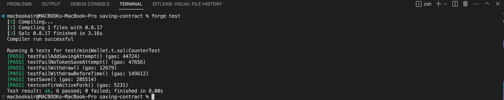

# Foundry: Deploying And Forking Mainnet With Foundry 

## Introduction
Some of us smart contract developers danced the bhangra when Foundry was released.
**Foundry is a convenient and comprehensive suite of tools for building and deploying decentralized applications (DApps) on the blockchain**. It is convenient because it lets you write tests in Solidity instead of Javascript, which is the scripting and testing language of the popular Hardhat toolkit.

In this tutorial, I will take you through how to deploy smart contract and fork the Celo Alfajores testnet with **Foundry**. By forking a blockchain, we can test and debug smart contracts in a local environment, which simulates the behaviour of the live blockchain network. 
I created this lesson because there are surprisingly few resources available online that cover mainnet/testnet forking with foundry.

At the end of this tutorial, you will be able to fork mainnet or testnet for testing and deploy a smart contract using the foundry toolkit. 

> This tutorial is focused on those who have some level of experience writing smart contracts with foundry. However, if you are new to foundry, I have listed some resources in the reference section that can help you get familiar with this toolkit.
## Table Of Contents 
* [Introduction](#introduction)
- [Prerequisites](#prerequisites)
- [Requirements](#requirements)
* [Getting Started](#getting-started)
- [Smart Contract](#smart-contract)
- [Code](#code)
- [Testing](#testing)
    * Fork Celo alfajores testnet
    * Deploy smart contract
* [Conclusion](#conclusion)
* [References](#references)

## Prerequisites 
Before going ahead with the tutorial, it is important for you to have a good understanding of 
* solidity 
* smart contracts 
* The EVM. 

## Requirements
* Infura account
* Foundry
* IDE

### Getting Started
- Clone this repository:
`git clone https://github.com/centie22/Foudry-Tutorial.git`
- Run `forge install` to install all dependencies.
- Open project in IDE.
## Smart Contract
We have `savings.sol` and `token.sol` smart contracts in the `src` folder. The first is a simple savings smart contract that allows users save a particular ERC20 token over a period of time.
The second is the ERC20 saving token used in the savings smart contract. This token has been deployed on the Celo Alfajores chain and to interact with it in testing our savings smart contract, we need to bring the Alfajores testnet to our local environment by forking it.

## Code
#### savings.sol
```solidity
// SPDX-License-Identifier: MIT
pragma solidity ^0.8.7;

import "lib/openzeppelin-contracts/contracts/token/ERC20/ERC20.sol";
import "lib/openzeppelin-contracts/contracts/token/ERC20/utils/SafeERC20.sol";

contract MiniWallet{
address admin;
bool public savingActive;
ERC20 savingToken;

struct Wallet {
    address walletOwner;
    uint walletBalance;
    uint savingDuration;
}

mapping (address => Wallet) savingWallet;

modifier adminRestricted() {
    require(msg.sender == admin, "Function call is restricted to contract admin");
    _;
}

event Saved(uint amount, uint savningDuration, string message);
event SavingUpdated(uint amount, string message);

constructor (ERC20 _savingToken){
    admin = msg.sender;
    savingToken = _savingToken;
}


function save(uint256 _amount, uint256 savingDurationInWeeks) external {
    require(msg.sender != address(0), "zero address can't call function");
    require(savingActive == true, "Saving inactive");
    require(_amount > 0, "Can't save zero tokens");
    require(savingDurationInWeeks > 1, "Saving duration must be more than 1 week");
    require(savingToken.balanceOf(msg.sender) >= _amount, "Current token balance less than _amount");
    savingToken.transferFrom(msg.sender, address(this), _amount);

    Wallet storage wallet = savingWallet[msg.sender];
    wallet.savingDuration = block.timestamp + (savingDurationInWeeks * 1 weeks);
    wallet.walletOwner = msg.sender;
    wallet.walletBalance += _amount;

    emit Saved(_amount, savingDurationInWeeks, "Tokens saved successfully");
}


function addSaving(uint256 _amount) external {
    require(savingActive == true, "Saving inactive");

    Wallet storage wallet = savingWallet[msg.sender];
    require(wallet.walletBalance > 0, "You have not saved before.");
    require(_amount > 0, "Can't save zero tokens");
    require(savingToken.balanceOf(msg.sender) >= _amount, "Insufficient token balance.");

    SafeERC20.safeTransferFrom(savingToken, msg.sender, address(this), _amount);

    wallet.walletBalance += _amount;
    uint256 theBalance = wallet.walletBalance;

    emit SavingUpdated(theBalance, "Successfully saved more tokens.");
}

function withdraw(uint256 _amount) external {
    Wallet storage wallet = savingWallet[msg.sender];
    require(msg.sender == wallet.walletOwner, "Caller not wallet owner.");
    require(wallet.walletBalance >= _amount, "_amount greater than balance.");

    if (block.timestamp >= wallet.savingDuration) {
        uint256 newBalance = wallet.walletBalance - _amount;
        wallet.walletBalance = newBalance;
        SafeERC20.safeTransfer(savingToken, msg.sender, _amount);
    } else {
        revert("Saving duration not elapsed");
    }
}

function viewWalletBalance () external view returns (uint balance){
     Wallet storage wallet = savingWallet[msg.sender];
     balance = wallet.walletBalance;
     return balance;
}

function activateSaving(bool saveStatus) external adminRestricted{
    savingActive = saveStatus;
}


}
```

#### token.sol
```solidity
// SPDX-License-Identifier: MIT

pragma solidity ^0.8.7;

import "lib/openzeppelin-contracts/contracts/token/ERC20/ERC20.sol";

contract token is ERC20("testToken", "tT") {
    constructor () {
        _mint(msg.sender, 1000000000e18);
    } 
}
```

## Testing
We have the test for the savings smart contract in written in the `miniWallet.t.sol` file in test folder.

```solidity
// SPDX-License-Identifier: UNLICENSED
pragma solidity ^0.8.7;

import "forge-std/Test.sol";
import "../src/savings.sol";
import "../src/token.sol";
import "lib/openzeppelin-contracts/contracts/token/ERC20/IERC20.sol";

contract CounterTest is Test {
    MiniWallet public miniWallet;
    address Alice;
    address Dilshad;
    address Shahad;
    IERC20 Token = IERC20 (0x865b5751bcDe7E06030670b4d9D27651A25f2fCF);
    uint256 alfajoresFork;
    string CELO_RPC_URL = vm.envString("CELO_RPC_URL");
    
    function setUp() public {
        alfajoresFork = vm.createFork(CELO_RPC_URL);
        vm.selectFork(alfajoresFork);
        miniWallet = new MiniWallet(ERC20 (0x865b5751bcDe7E06030670b4d9D27651A25f2fCF));
        miniWallet.activateSaving(true);
        Alice = 0xE7818b0e067Bc205B0a2A3055818083D13F11aA8;
        Dilshad = 0x085Ee67132Ec4297b85ed5d1b4C65424D36fDA7d;
        Shahad = 0xD06e61faEB0d8a7B0835C0F3C127aED98908a687;
        address holder = 0x049C780d7fa94AA70194eFC88ee109781eaeE1C2;
        uint HolderBalance = Token.balanceOf(holder); 
        emit log_uint(HolderBalance);
        vm.startPrank(holder);
        Token.transfer(Alice, 10000);
        Token.transfer(Dilshad, 10000);
        Token.transfer(Shahad, 10000);
        vm.stopPrank();
        assert(Token.balanceOf(Alice) == 10000);
         assert(Token.balanceOf(Dilshad) ==10000);
         assert(Token.balanceOf(Shahad) == 10000);
    }

    function testconfirmActiveFork() public{
        assertEq(vm.activeFork(), alfajoresFork);
    }


    function testSave() public {
// Prank Alice address to test save() and addSaving() and viewWalletBalance() functions 
       vm.startPrank(Alice);
       Token.approve(address(miniWallet), 800);
        miniWallet.save(600, 4);
        miniWallet.viewWalletBalance();
        miniWallet.addSaving(100);
        miniWallet.viewWalletBalance();
        vm.stopPrank();


// Prank Dilshad address to test save(), viewWalletBalance(), and addSaving functions
        vm.startPrank(Dilshad);
        Token.approve(address(miniWallet), 800);
        miniWallet.save(300, 2);
        miniWallet.viewWalletBalance();
        miniWallet.addSaving(300);
        miniWallet.viewWalletBalance();
        vm.stopPrank();
    }

// Attempt to addSaving() without any previous saving on address Shahad. 
//This test is expected to fail because Shahad hasn't used the saved tokens before.

    function testFail_addSavingAttempt() public {
        vm.startPrank(Shahad);
        Token.approve(address(miniWallet), 800);
        miniWallet.addSaving(300);
        miniWallet.viewWalletBalance();
       vm.stopPrank();
    }

// Test withdraw() function with address Dilshad before saving time elapses.
    function testFail_WithdrawBeforeTime() public{
       vm.startPrank(Dilshad);
       Token.approve(address(miniWallet), 800);
       miniWallet.save(300, 2);
       miniWallet.withdraw(300);
       vm.stopPrank();
    }

// Test withdraw() function with address Shahad, which hasn't saved any token on savings.sol
    function testFail_Withdraw() public {
       vm.startPrank(Shahad);
       miniWallet.withdraw(200);
       vm.stopPrank();
    }


  
    }
```

The Token used in the test code has already been deployed on the Alfajores chain, hence we must fork the Alfajores chain in order to interact with its functions in our local environment. Check out the process: 

### Fork Celo Alfajores testnet
There is a tonne going on in the test code, notably in the `setUp()` function, but our focus in this section is on the procedures involved in forking the Celo Alfajores testnet. Therefore, let's go through it. Foundry "forge" offers two methods for supporting testing in a forked environment:
1. The Forking Mode.
2. Forking Cheatcodes.
The Forking Cheatcode method will be used in this tutorial. You can create, choose, and manage several forks in your solidity test code using this technique.
1. #### Setting up your `.env` file.
In your `.env` file, set the variable
```
CELO_RPC_URL= 'https://celo-alfajores.infura.io/v3/[INFURA_KEY]'
```
2. #### Access the .env file variable.
After setting up your `.env` file, you can now go over to the test file where you will be needing the `CELO_RPC_URL` variable just created, which in our case is `miniWallet.t.sol`. We can access the variable in `.env` file with **`vm.envString(VariableName)`**. In our test code, we will have
```solidity
string CELO_RPC_URL = vm.envString("CELO_RPC_URL");
```
as a state variable.

3. #### Create Alfajores testnet fork
In order to make the forked network available to all available in each test, we will create the fork in the `setUp()` function. Let us take this one step at a time:

1. Create a variable in state that will be a unique identifier for our fork.
```solidity
uint256 alfajoresFork;
```
2. In `setUp()`, assign this variable.
```solidity
    alfajoresFork = vm.createFork(CELO_RPC_URL);
```
`createFork` is a cheatcode that creates forks. Hence, we just created the alfajores fork in our solidity code with it.

3. Enable the created fork.
```solidity
        vm.selectFork(alfajoresFork);
```
`selectFork` is the cheatcode that is used to enable a created fork. Since alfajoresFork is the fork just created and we want to interact with, we get it running in our local environment with `selectFork`.

> We can run this three step process in one line of code:
> ```solidity
> uint256 alfajoresFork = vm.createSelectFork(CELO_RPC_URL);
> ```
> This strategy is suitable when forking just one network. However, the approach described in the tutorial is the best one to utilise if you plan to create and use several forks.

Now that we have forked the Alfajores testnet and wriiten our contract testcode, we can run ```forge test``` to see if everything works perfectly. 


Everything works just fine!